  

  

  
  
  

  <em>"Thought rolls for hungry minds from brainwaves to neural nets, one bite at a time."</em> 🍣

## Tools

**Research**

**Infrastructure**

**Also**

## GitHub Activity

  
  

  

  <picture>
    <source media="(prefers-color-scheme: dark)" srcset="https://raw.githubusercontent.com/soroushdeimi/soroushdeimi/output/github-snake-dark.svg" />
    
  </picture>

  

